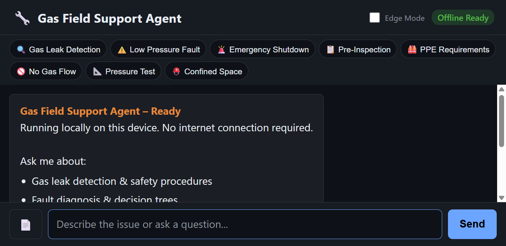
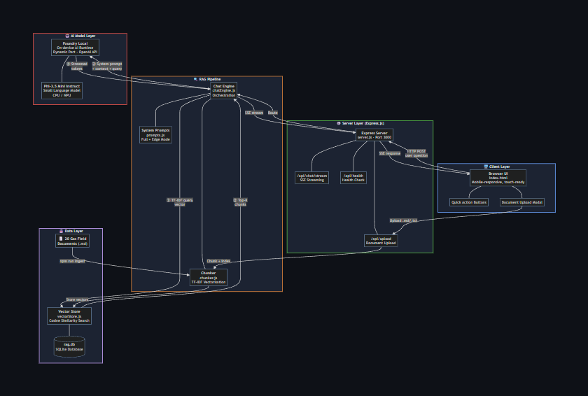
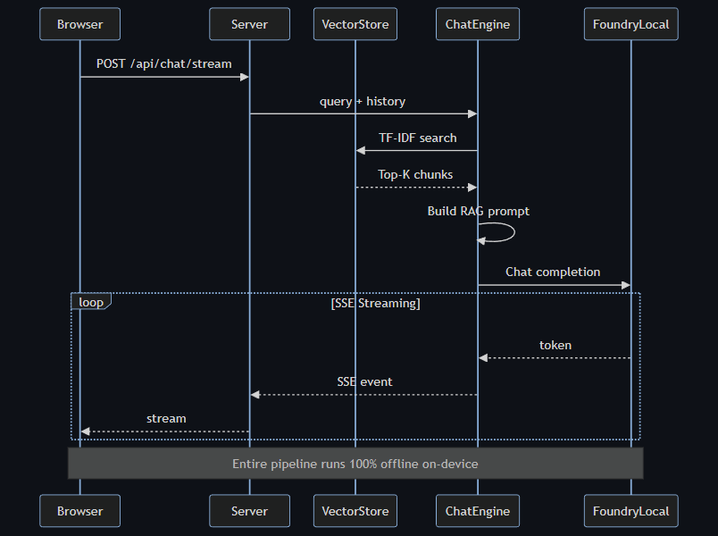
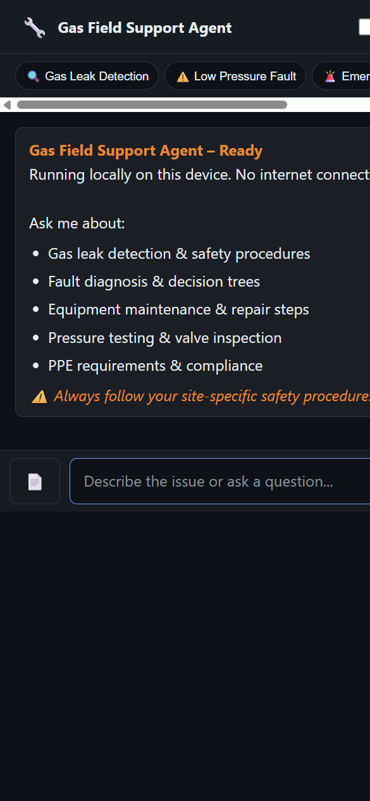
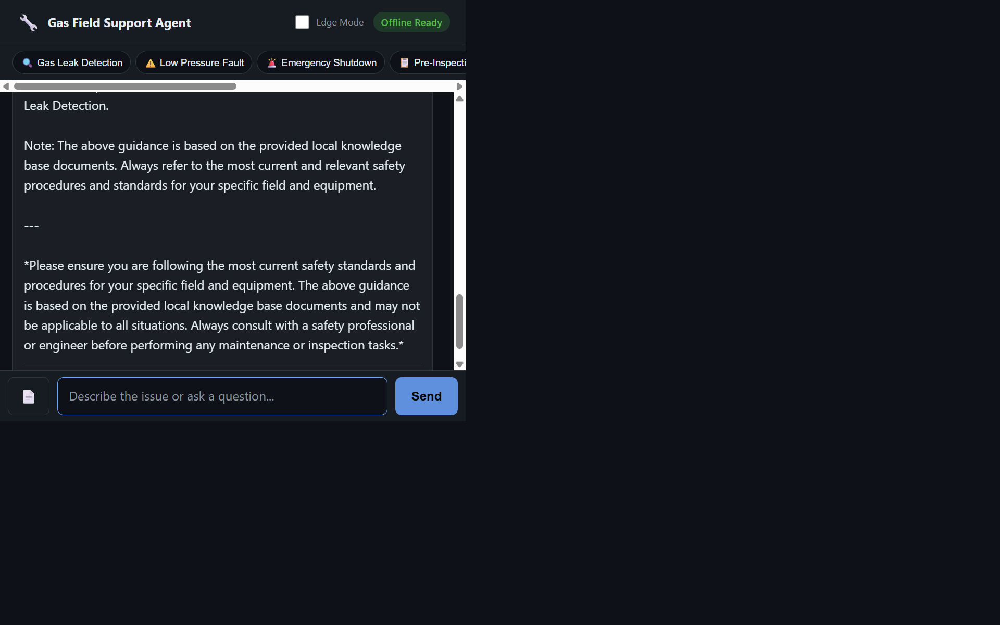
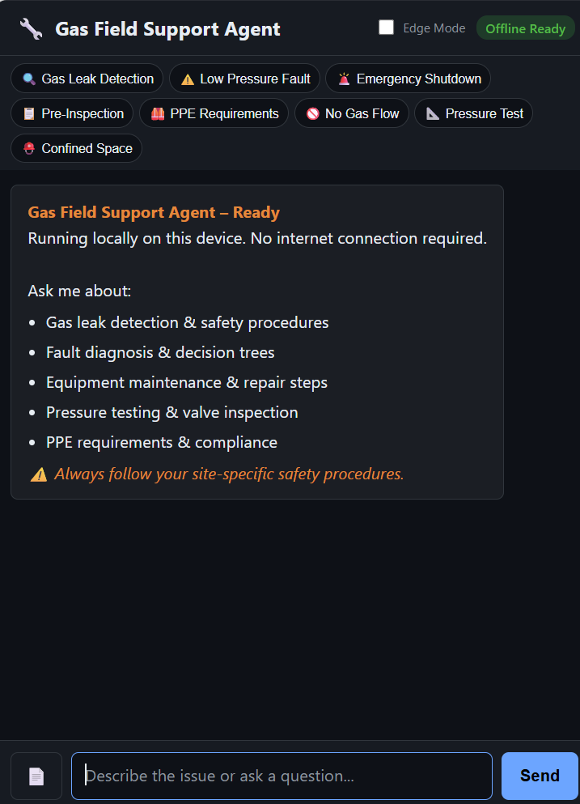
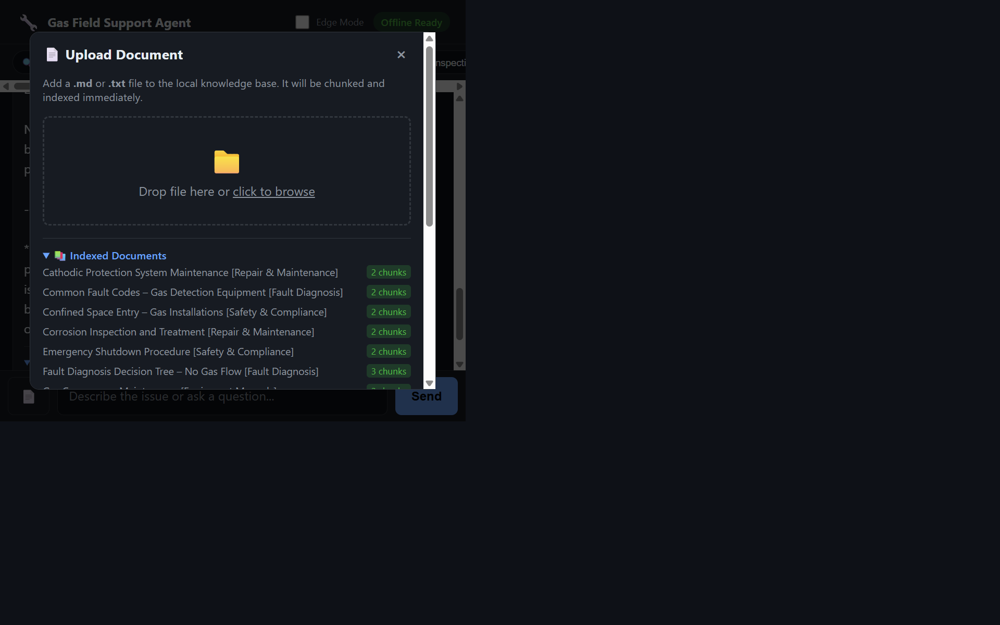

[](https://developer.mozilla.org/en-US/docs/Web/JavaScript)
[](https://nodejs.org/)
[](https://foundrylocal.ai)
[](https://huggingface.co/microsoft/Phi-3.5-mini-instruct)
[](LICENSE)
[]()

# Gas Field Local RAG – Offline Support Agent

A fully offline, on-device **Retrieval-Augmented Generation (RAG)** support agent for gas field inspection and maintenance engineers. Built with **[Foundry Local](https://foundrylocal.ai)** and **Phi-3.5 Mini Instruct**, this sample shows you how to build a production-style RAG application that runs entirely on your machine — no cloud, no API keys, no internet required.



> **New to RAG?** Retrieval-Augmented Generation is a pattern where an AI model's answers are grounded in a specific set of documents. Instead of relying solely on what the model learned during training, RAG retrieves relevant chunks from your own documents and feeds them to the model as context. This dramatically reduces hallucination and makes the AI useful for domain-specific tasks.

## What You'll Learn

If you're a developer getting started with AI-powered applications, this project demonstrates:

1. **How RAG works end-to-end** – document ingestion, chunking, vector storage, retrieval, and generation
2. **Running AI models locally** with [Foundry Local](https://foundrylocal.ai) (no GPU required, works on CPU/NPU)
3. **Building a mobile-responsive web UI** that works in the field (large touch targets, high contrast, PWA-ready)
4. **Streaming AI responses** using Server-Sent Events (SSE)
5. **TF-IDF vector search** with SQLite — no external vector database needed

## Architecture



**How a query flows:**



1. The user types a question in the browser
2. The Express server receives it and searches the SQLite vector store for the most relevant document chunks
3. Those chunks are injected into the prompt as context
4. Foundry Local generates a response using Phi-3.5 Mini, grounded in the retrieved context
5. The response streams back to the browser via SSE

## Features

- **100% offline** – no internet, no cloud, no outbound calls
- **Safety-first prompting** – safety warnings surface before any procedure
- **RAG retrieval** – answers grounded in local gas engineering documents
- **Streaming responses** – real-time SSE streaming to the UI
- **Mobile responsive** – works on phones, tablets, and desktops in the field
- **Edge/compact mode** – toggle for extreme latency / constrained devices
- **Document upload** – add new `.md`/`.txt` documents from the UI at runtime
- **Field-ready UI** – high contrast, large touch targets, works with gloves/PPE

| Desktop | Mobile |
|---------|--------|
|  |  |

## Prerequisites

Before you begin, make sure you have:

- **Node.js** ≥ 20 — [Download here](https://nodejs.org/)
- **Foundry Local** — Microsoft's on-device AI runtime
  ```
  winget install Microsoft.FoundryLocal
  ```
- The **phi-3.5-mini** model (auto-downloaded on first run via the SDK — ~2 GB)

> **Tip:** Run `foundry model list` to check which models are already cached on your machine.

## Quick Start

```bash
# 1. Clone the repository
git clone https://github.com/leestott/local-rag.git
cd local-rag

# 2. Install dependencies
npm install

# 3. Ingest the 20 gas engineering documents into the local vector store
npm run ingest

# 4. Start the server (starts Foundry Local automatically)
npm start
```

Open **http://127.0.0.1:3000** in a browser. You should see the landing page with quick-action buttons and the chat input.

### What Happens at Startup

1. **`npm run ingest`** reads every `.md` file in `docs/`, splits them into overlapping chunks, computes TF-IDF vectors, and stores everything in `data/rag.db` (SQLite).
2. **`npm start`** launches Foundry Local, loads the Phi-3.5 Mini model, opens the vector store, and starts the Express server on port 3000.

## Chatting with the Agent

Type a question or tap one of the quick-action buttons. The agent retrieves relevant document chunks and generates a safety-first response:



Every response includes expandable source references so you can verify which documents the answer came from:


### Mobile Chat

The UI is fully responsive — the same interface works on mobile devices with appropriately sized touch targets:



## Uploading Documents

You can expand the knowledge base without restarting the server. Click the 📄 button to open the upload modal:



Drag-and-drop or browse for `.md`/`.txt` files. They are chunked and indexed immediately.

### Via File System

1. Add `.md` files to the `docs/` folder (with optional YAML front-matter for title/category/id).
2. Run `npm run ingest` to re-index all documents.

### Document Format

```markdown
---
title: My Procedure Title
category: Inspection Procedures
id: DOC-CUSTOM-001
---

# My Procedure Title

## Safety Warning
- Important safety note here.

## Procedure
1. Step one.
2. Step two.
```

## Project Structure

```
LOCAL-RAG/
├── docs/                     # 20 gas engineering RAG documents
│   ├── 01-gas-leak-detection.md
│   ├── 02-regulator-fault-low-pressure.md
│   ├── 03-emergency-shutdown.md
│   ├── ...
│   └── 20-no-gas-flow-decision-tree.md
├── public/
│   └── index.html            # Field engineer web UI (single-file, no build step)
├── src/
│   ├── chatEngine.js         # Foundry Local + RAG orchestration
│   ├── chunker.js            # Document chunking + TF-IDF vector computation
│   ├── config.js             # App configuration (model, paths, chunk sizes)
│   ├── ingest.js             # Batch document ingestion script
│   ├── prompts.js            # System prompts (full + compact/edge)
│   ├── server.js             # Express server + API endpoints
│   └── vectorStore.js        # SQLite-backed local vector store
├── screenshots/              # App screenshots
├── test/                     # Unit tests (Node.js test runner)
├── data/                     # Generated at runtime
│   └── rag.db                # SQLite vector database
├── package.json
└── README.md
```

## How the RAG Pipeline Works

Understanding each stage will help you adapt this pattern to your own projects:

### 1. Document Ingestion (`src/ingest.js`)

Reads `.md` files from `docs/`, parses optional YAML front-matter, then splits the content into overlapping chunks (default: ~200 tokens with 25-token overlap). Each chunk is stored with its TF-IDF vector in SQLite.

### 2. Vector Store (`src/vectorStore.js`)

A lightweight vector store backed by SQLite (via `better-sqlite3`). Stores document chunks alongside their TF-IDF vectors. At query time, it cosine-similarity-ranks all chunks against the query vector and returns the top-K results.

### 3. Chat Engine (`src/chatEngine.js`)

Orchestrates the full RAG flow:
- Converts the user's question into a TF-IDF vector
- Retrieves the top-K most relevant chunks
- Builds a prompt with the system instructions + retrieved context + user question
- Sends it to the local Phi-3.5 Mini model via the OpenAI-compatible API
- Streams the response back chunk-by-chunk

### 4. System Prompts (`src/prompts.js`)

Two prompt variants:
- **Full mode** (~300 tokens): detailed instructions for safety-first, structured responses
- **Edge mode** (~80 tokens): minimal prompt for constrained devices with limited context windows

## Chunking Strategy

The chunking approach is one of the most important design decisions in any RAG system — it directly affects retrieval accuracy, response quality, and performance. This project uses a **fixed-size sliding window with overlap**, and that choice is deliberate.

### How It Works

Documents are split into chunks of **~200 whitespace-delimited tokens** with a **25-token overlap** between consecutive chunks (configured in [`src/config.js`](src/config.js)). The core logic lives in [`src/chunker.js`](src/chunker.js):

1. YAML front-matter (title, category, id) is stripped and stored as metadata
2. The body text is tokenized by whitespace
3. A sliding window walks through the tokens, emitting one chunk per step
4. Each new window starts 25 tokens before the previous one ended, creating overlap
5. Documents shorter than 200 tokens are kept as a single chunk

### Why Fixed-Size Sliding Window?

| Design constraint | How fixed-size chunking helps |
|---|---|
| **Small local model (Phi-3.5 Mini)** | 200-token chunks keep retrieved context compact, leaving room in the model's context window for the system prompt, conversation, and generated output |
| **NPU/CPU execution** | No embedding model needed for chunking — just string operations. All compute budget stays with the LLM |
| **Zero dependencies** | No tokenizer library, no embedding runtime, no vector database. Chunking is pure JavaScript |
| **Predictable memory** | Every chunk is roughly the same size, so retrieval cost and context usage are consistent and predictable |

### Why Not Other Strategies?

| Alternative | Trade-off |
|---|---|
| **Sentence-based** | Chunk sizes vary unpredictably; some safety procedures are single long sentences that wouldn't split well |
| **Section-aware** (split on `##` headings) | Section lengths vary widely across the 20 docs — some would be too small (wasting retrieval slots), others too large for the model's context window |
| **Recursive** (LangChain-style) | Better boundary handling, but adds complexity and dependencies for marginal gain on short documents |
| **Semantic** (embedding-based topic detection) | Best retrieval quality, but requires a second model in memory alongside Phi-3.5 Mini — risky on constrained NPU/CPU hardware with 8–16 GB shared memory |

### Performance Benefits

**For the system:**
- **~1ms retrieval** — TF-cosine similarity over fixed-size chunks is near-instant, compared to ~100–500ms if an embedding model had to encode each query
- **Fast ingestion** — all 20 documents are chunked and indexed in under a second; no embedding computation required
- **Single model in memory** — no embedding model competing with the LLM for limited NPU/RAM resources
- **Minimal storage** — chunks stored as plain text in SQLite with lightweight TF-IDF vectors; no high-dimensional embedding arrays

**For the end user:**
- **Instant search results** — the retrieval step adds negligible latency, so the user only waits for the LLM to generate
- **Higher-quality generation** — compact 200-token chunks mean the model receives focused, relevant context rather than large noisy blocks
- **Consistent response times** — uniform chunk sizes mean retrieval and generation latency is predictable regardless of which documents are matched
- **Works on modest hardware** — the lightweight pipeline runs on laptops and field devices without a dedicated GPU

### When to Consider Switching

If you adapt this project for larger or more complex document sets, consider upgrading the chunking strategy:

- **Hundreds of long documents** → recursive or section-aware chunking to better respect document structure
- **Embedding-based retrieval** → semantic chunking becomes worthwhile when paired with vector similarity search
- **Mixed content types** (tables, code, prose) → format-aware chunking to keep logical units intact
- **Higher precision requirements** → sentence-level chunking to avoid partial-match noise

For the current use case — 20 short procedural guides on constrained local hardware — fixed-size sliding window delivers the best balance of simplicity, speed, and retrieval quality.

## API Endpoints

| Method | Endpoint | Description |
|--------|----------|-------------|
| `POST` | `/api/chat` | Non-streaming chat completion |
| `POST` | `/api/chat/stream` | Streaming chat via SSE |
| `POST` | `/api/upload` | Upload a document to the knowledge base |
| `GET` | `/api/docs` | List indexed documents |
| `GET` | `/api/health` | Health check |

## RAG Document Categories

The 20 included documents cover:

| # | Category | Documents |
|---|----------|-----------|
| 1 | Safety & Compliance | Emergency shutdown, PPE, confined space, hot work permits |
| 2 | Inspection Procedures | Leak detection, pressure testing, valve inspection, pipeline integrity, pre-inspection checklist |
| 3 | Fault Diagnosis | Regulator faults, gas detector fault codes, no-gas-flow decision tree |
| 4 | Repair & Maintenance | Gasket replacement, cathodic protection, corrosion treatment, purging |
| 5 | Equipment Manuals | Compressor maintenance, sensor calibration, relief valve testing, meter installation |

## Edge / Compact Mode

Toggle **Edge Mode** in the UI header for constrained devices:

| Setting | Full Mode | Edge Mode |
|---------|-----------|-----------|
| System prompt | ~300 tokens | ~80 tokens |
| Max output tokens | 1024 | 512 |
| Retrieved chunks | 5 | 3 |

## Key Concepts for New Developers

### What is Foundry Local?

[Foundry Local](https://foundrylocal.ai) is Microsoft's on-device AI runtime. It lets you run small language models (SLMs) like Phi-3.5 Mini directly on your laptop or workstation — no GPU required, no cloud dependency. It exposes an **OpenAI-compatible API**, so you can use the standard `openai` npm package to interact with it.

```js
import { FoundryLocalManager } from "foundry-local-sdk";
import { OpenAI } from "openai";

const manager = new FoundryLocalManager();
const modelInfo = await manager.init("phi-3.5-mini");

// Use the standard OpenAI client — just point it at the local endpoint
const client = new OpenAI({
  baseURL: manager.endpoint,  // e.g. "http://127.0.0.1:<dynamic-port>/v1"
  apiKey: manager.apiKey,
});
```

### What is TF-IDF?

TF-IDF (Term Frequency–Inverse Document Frequency) is a classic information retrieval technique. Each document chunk is converted into a numeric vector based on how important each word is within that chunk relative to all chunks. At query time, the user's question is vectorized the same way and compared against all stored vectors using cosine similarity.

This project uses TF-IDF instead of embedding models to keep everything lightweight and offline — no embedding API or large model needed for retrieval.

### Why SQLite for Vectors?

For small-to-medium document collections (hundreds to low thousands of chunks), SQLite is fast enough for brute-force cosine similarity search and adds zero infrastructure. No need for Pinecone, Qdrant, or Chroma — just a single `.db` file on disk.

## Running Tests

```bash
npm test
```

Tests use the built-in Node.js test runner (no extra dependencies). They cover the chunker, vector store, config, and server endpoints.

## Scripts

| Script | Command | Description |
|--------|---------|-------------|
| Ingest | `npm run ingest` | Chunk and index all docs into SQLite |
| Start | `npm start` | Start the server (production) |
| Dev | `npm run dev` | Start with auto-restart on file changes |
| Test | `npm test` | Run unit tests |

## Adapting This for Your Own Use Case

This project is a scenario sample — you can fork it and adapt it to any domain:

1. **Replace the documents** in `docs/` with your own `.md` files (product manuals, internal wikis, support articles)
2. **Edit the system prompt** in `src/prompts.js` to match your domain and tone
3. **Adjust chunk sizes** in `src/config.js` — smaller chunks for precise retrieval, larger for more context
4. **Swap the model** — change `config.model` to any Foundry Local-supported model (run `foundry model list` to see available models)
5. **Customise the UI** — the frontend is a single HTML file with inline CSS, easy to modify

## License

MIT – This solution is a scenario sample for learning and experimentation.
